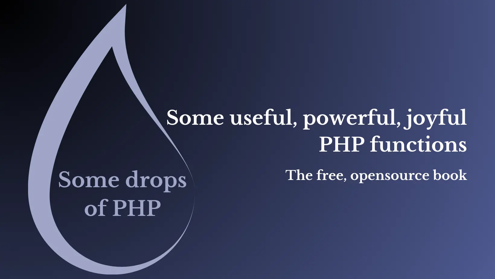

# Welcome to Some drops of PHP

## The reason why
This book collects some useful, unknown, underrated PHP functions or stuff discovered, used, and learned during PHP daily use.

Using PHP frameworks/libraries daily, sometimes the perception of the power of the language and the basic functionalities provided by the PHP core could be lost.
I see that usually, I used to look at the framework documentation or look for a package in Packagist for the system, array, and string functions instead of using core functionalities provided by the language.

While I wrote this ebook in HTML format, I also wrote some scripts to better understand the behavior of the functions. You can find these examples here: https://github.com/roberto-butti/some-drops-of-php in the _examples_ directory.

> We are excited to invite you to Contribute to this book. More [info here](https://github.com/roberto-butti/some-drops-of-php/blob/main/CONTRIBUTING.md)

### Requirements

The code used in this book is tested with **PHP 8.3** (and PHP 8.2).

The supported PHP versions are listed here: https://www.php.net/supported-versions.php.

### Continuous release

I was thinking of printing this book, but I think that is not so eco-friendly and a book about development could be improved daily in terms of spellchecking and the content and examples. So, I expect to adopt the same approach in the software with the CI/CD, with a continuous release of the book.

Releases:

> The book is a Work in Progress. If you notice any errors or believe that a new function should be covered, feel free to open an issue [here](https://github.com/roberto-butti/some-drops-of-php/issues).

### Where to find this book

This book is available here: [https://drops-of-php.hi-folks.dev/](https://drops-of-php.hi-folks.dev/).

- Markdown files: [content directory](https://github.com/roberto-butti/some-drops-of-php/tree/main/src/content/docs);
- Example files: [examples directory](https://github.com/roberto-butti/some-drops-of-php/tree/main/examples);

### Thanks to...

Thanks to all the Open Source community and all the [contributors](https://github.com/roberto-butti/some-drops-of-php/graphs/contributors).

### License
"Some drops of PHP" (c) by Roberto Butti

"Some drops of PHP" is licensed under a
Creative Commons Attribution-NonCommercial-ShareAlike 4.0 International License.

You should have received a copy of the license along with this
work. If not, see <http://creativecommons.org/licenses/by-nc-sa/4.0/>.
