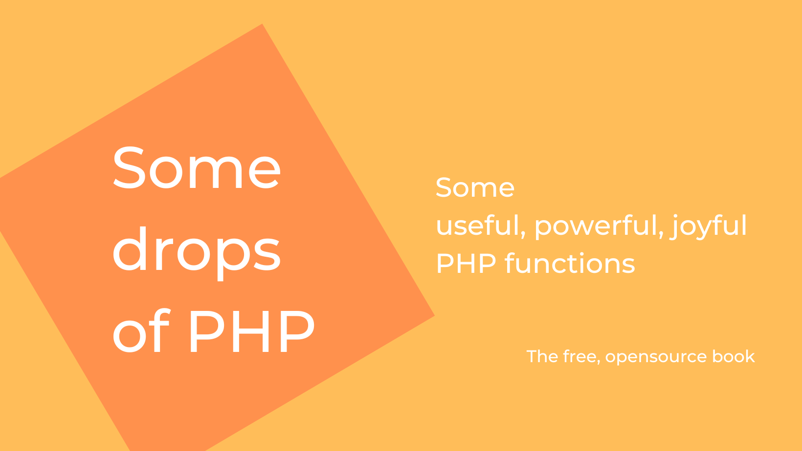

# Welcome to Some drops of PHP

## The reason why
This book collects some useful, unknown, underrated PHP functions or stuff discovered, used, and learned during PHP daily use.

Using PHP frameworks/libraries daily, sometimes the perception of the power of the language and the basic functionalities provided by the PHP core could be lost.
I see that usually, I used to look at the framework documentation or look for a package in Packagist for the system, array, and string functions instead of using core functionalities provided by the language.

While I wrote this  HTML-book, I also wrote some scripts to better understand the behavior of the functions. You can find these examples here: https://github.com/roberto-butti/some-drops-of-php in the _examples_ directory.

> We are excited to invite you to join our Hacktoberfest celebration by contributing to the open-source book project. More [info here](HACKTOBERFEST.md)

### Requirements

The code used in this book is tested with **PHP 8.2**.

The supported PHP versions are listed here: https://www.php.net/supported-versions.php.

### Continuous release

I was thinking to print this book, but I think that is not so eco-friendly and a book about development could be improved daily in terms of spellchecking and the content and examples. So, I expect to adopt the same approach in the software with the CI/CD, with a continuous release of the book.

Releases:

- **W.I.P.** the 1.0.0 version is not yet released: writing... ;

> The book is **Work in Progress**, the list of the functions covered by the book at the moment are listed in [list-of-functions.md](list-of-functions.md) file

So, if you have any feedback, or you want to suggest some corrections, feel free to open an issue here: https://github.com/roberto-butti/some-drops-of-php/issues

### Where to find this book

This book is available TBD.

- Markdown files: [content/](content/);
- Example files: [examples/](examples/);

### Thanks to...

Thanks to all the Open Source community.

### License
"Some drops of PHP" (c) by Roberto Butti

"Some drops of PHP" is licensed under a
Creative Commons Attribution-NonCommercial-ShareAlike 4.0 International License.

You should have received a copy of the license along with this
work. If not, see <http://creativecommons.org/licenses/by-nc-sa/4.0/>.
